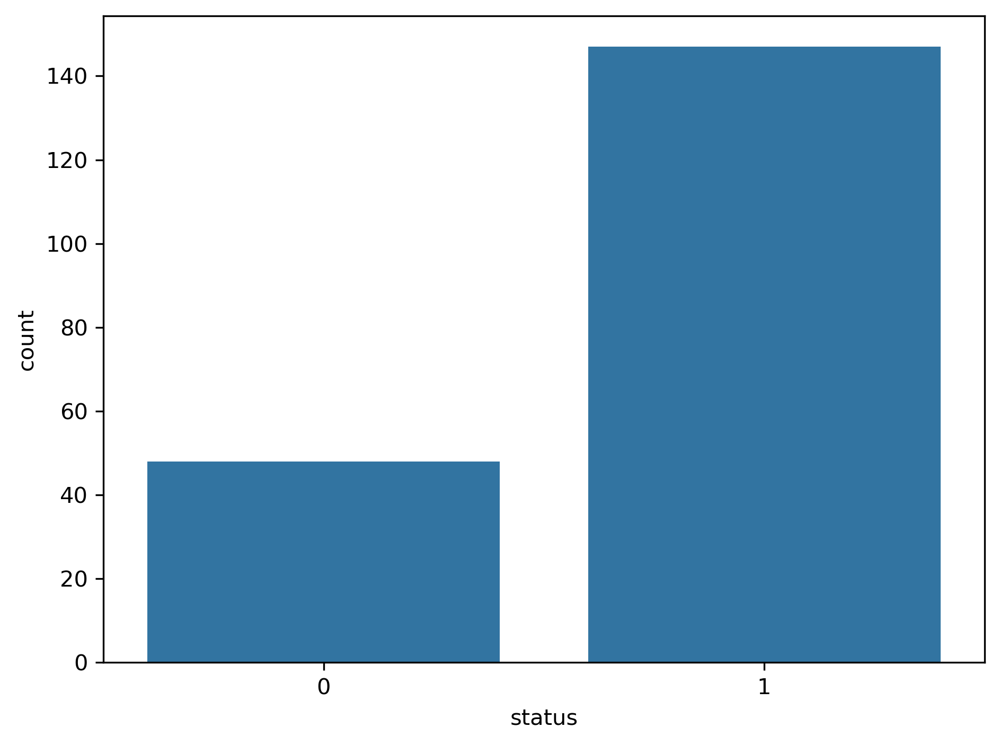
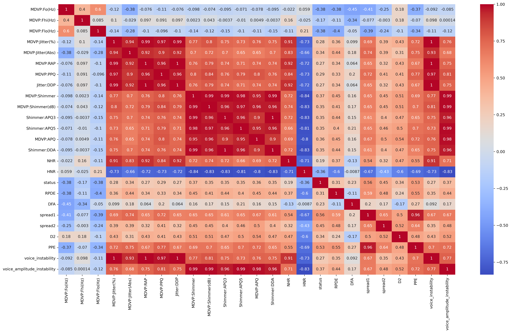
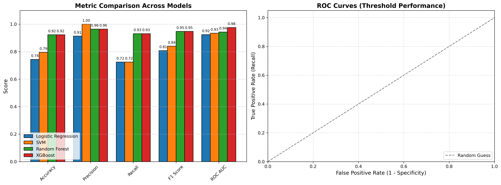
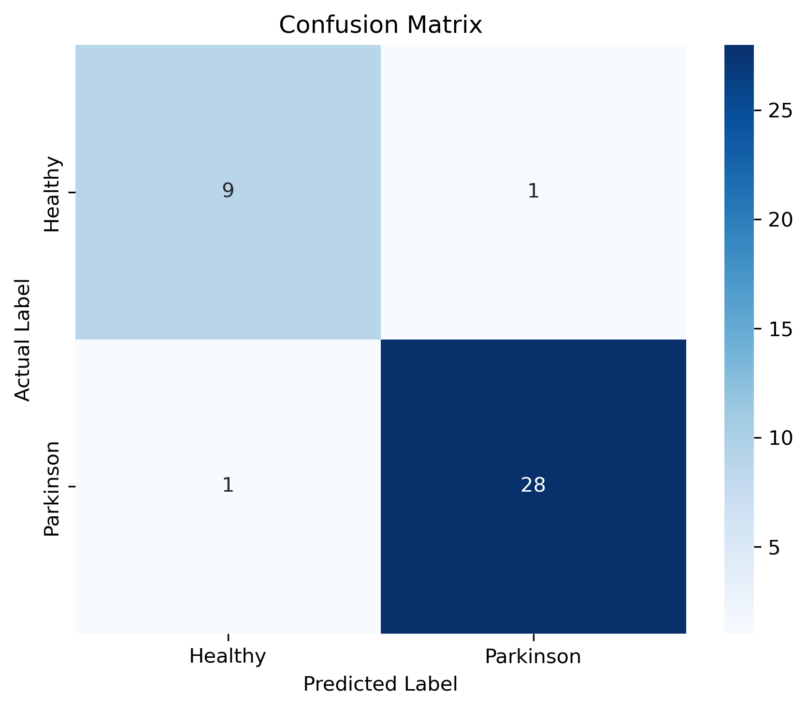

# Parkinson.AI — Voice-Based Parkinson's Prediction System

This project is a machine learning system that predicts Parkinson's disease risk based on voice features. The system was trained on the Oxford Parkinson's disease detection dataset and uses XGBoost for classification.

## Dataset used: https://www.kaggle.com/datasets/thecansin/parkinsons-data-set 

This dataset is composed of a range of biomedical voice measurements from 31 people, 23 with Parkinson's disease (PD). Each column in the table is a particular voice measure, and each row corresponds one of 195 voice recording from these individuals ("name" column). The main aim of the data is to discriminate healthy people from those with PD, according to "status" column which is set to 0 for healthy and 1 for PD.

## Attribute Information:

Matrix column entries (attributes): name - ASCII subject name and recording number

MDVP:Fo(Hz) - Average vocal fundamental frequency 

MDVP:Fhi(Hz) - Maximum vocal fundamental frequency

MDVP:Flo(Hz) - Minimum vocal fundamental frequency 

MDVP:Jitter(%),MDVP:Jitter(Abs),MDVP:RAP,MDVP:PPQ,Jitter:DDP - Several measures of variation in fundamental frequency 

MDVP:Shimmer,MDVP:Shimmer(dB),Shimmer:APQ3,Shimmer:APQ5,MDVP:APQ,Shimmer:DDA - Several measures of variation in amplitude 

NHR,HNR - Two measures of ratio of noise to tonal components in the voice status - Health status of the subject (one) - Parkinson's, (zero) - healthy 

RPDE,D2 - Two nonlinear dynamical complexity measures 

DFA - Signal fractal scaling exponent 

spread1,spread2,PPE - Three nonlinear measures of fundamental frequency variation

## Table of Contents
1. [Overview](#overview)
2. [Installation](#installation)
3. [Usage](#usage)
4. [Model Training](#model-training)
5. [Tech Stack](#tech-stack)
6. [Results](#results)
7. [Deployment](#deployment)


## Overview
Parkinson's disease
Parkinson's disease is a movement disorder of the nervous system that worsens over time.
In Parkinson's disease, nerve cells in the brain called neurons slowly break down or die. Many Parkinson's disease symptoms are caused by a loss of neurons that produce a chemical messenger in the brain. This messenger is called dopamine.
People with Parkinson's disease also lose a chemical messenger called norepinephrine that controls many body functions, such as blood pressure.
Symptoms can be different for everyone.

Parkinson's disease classification : The goal is to classify patients on the based of their speech changes symptoms (voice features)

Parkinson.AI is a machine learning-based system that predicts the risk of Parkinson’s disease by analyzing voice features. Using the UCI Parkinson’s dataset, we extracted 22 acoustic features and built a predictive model using XGBoost.

                          ┌────────────────────────────┐
                          │    Parkinson Dataset       │
                          │ (Biomedical Voice Features)│
                          └─────────────┬──────────────┘
                                        │
                                        ▼
                    ┌─────────────────────────────────────┐
                    │         Data Preprocessing          │
                    │ • Remove unnecessary columns        │
                    │ • Handle missing values             │
                    │ • Feature cleaning                  │
                    │ • Prepare input/output data         │
                    └─────────────┬───────────────────────┘
                                  │
                                  ▼
                    ┌─────────────────────────────────────┐
                    │      Feature Selection Stage        │
                    │ • Analyze feature importance        │
                    │ • Select top 15 important features  │
                    └─────────────┬───────────────────────┘
                                  │
                                  ▼
                    ┌─────────────────────────────────────┐
                    │         Train-Test Split            │
                    │        (Training / Testing)         │
                    └─────────────┬───────────────────────┘
                                  │
                                  ▼
       ┌──────────────────────────────────────────────────────┐
       │               Train Multiple ML Models               │
       └───────┬──────────────┬──────────────┬────────────────┘
               │              │              │
               ▼              ▼              ▼
     ┌──────────────┐ ┌──────────────┐ ┌──────────────┐
     │ Logistic Reg │ │ RandomForest │ │      SVM     │
     └──────┬───────┘ └──────┬───────┘ └──────┬───────┘
            │                │                │
            └────────────────┼────────────────┘
                             │
                             ▼
                     ┌──────────────┐
                     │   XGBoost    │
                     └──────┬───────┘
                            │
                            ▼
              ┌──────────────────────────────┐
              │      Model Evaluation        │
              │ • Accuracy                   │
              │ • Precision                  │
              │ • Recall                     │
              │ • F1 Score                   │
              │ • ROC-AUC Score              │
              └──────────────┬───────────────┘
                             │
                             ▼
              ┌──────────────────────────────┐
              │  Compare All 4 Models        │
              │  XGBoost Performs Best       │
              └──────────────┬───────────────┘
                             │
                             ▼
              ┌──────────────────────────────┐
              │   Save Final Model (.pkl)    │
              │ • parkinsons_model.pkl       │
              │ • top_features.pkl           │
              │ • threshold.pkl              │
              └────────────── ───────────────┘


## Installation
1. Clone the repository:
   ```bash
   git clone https://github.com/yourusername/parkinson-ai.git
2. Create a virtual environment (optional but recommended):
   ```bash
   python -m venv venv
   source venv/bin/activate  # or venv\Scripts\activate on Windows
3. Install dependencies:
   ```bash
   pip install -r requirements.txt


## Usage
1. Start the backend API (FastAPI):
   ```bash
   uvicorn app:app --reload --port 8000
2. Access the frontend on your local machine (e.g., via Streamlit or a static HTML page).
3. Use the form to input voice measurements and click "Predict" to get results.


## Model Training
The dataset was split into training and test sets using an 80-20 split. We evaluated four models—Logistic Regression, SVM, Random Forest, and XGBoost—using 5-fold cross-validation. XGBoost consistently achieved the highest AUC and F1-score, prompting us to select it. Hyperparameter tuning was performed using grid search over learning rate, max depth, and regularization. The best model was saved using Joblib for deployment.


## Tech Stack
- Python
- XGBoost, Scikit-learn
- FastAPI (for backend)
- Pandas, NumPy (data manipulation)
- HTML, CSS, JavaScript (frontend)
- Jinja2 (templating)
- Joblib (model persistence)
- Render (for deployment)

## Results
The XGBoost model achieved an accuracy of 94%, an AUC of 0.96, and an F1-score of 0.93 on the test set. These results indicate a strong ability to differentiate between healthy individuals and those

  
*Figure 1: Target distribution in dataset(0-> Healthy 1->Parkinson).*

  
*Figure 2: Heatmap.*

  
*Figure 3: Model Comparison.*

  
*Figure 1: Confusion Matrix of XGBoost.*

## Deployment
The model was deployed using FastAPI for the backend API, and the frontend was built as a static web page. The entire application is hosted on Render, enabling users to interact with the prediction API in real time.
     
